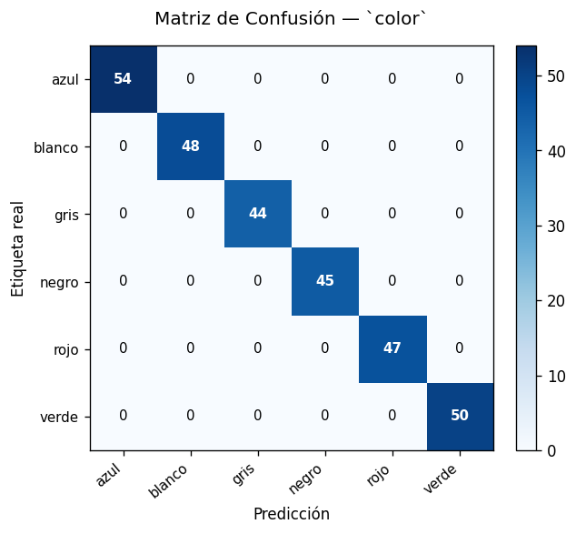
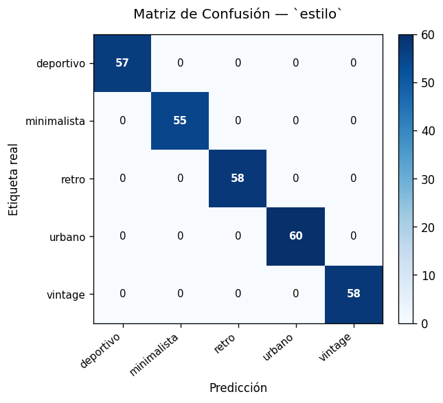
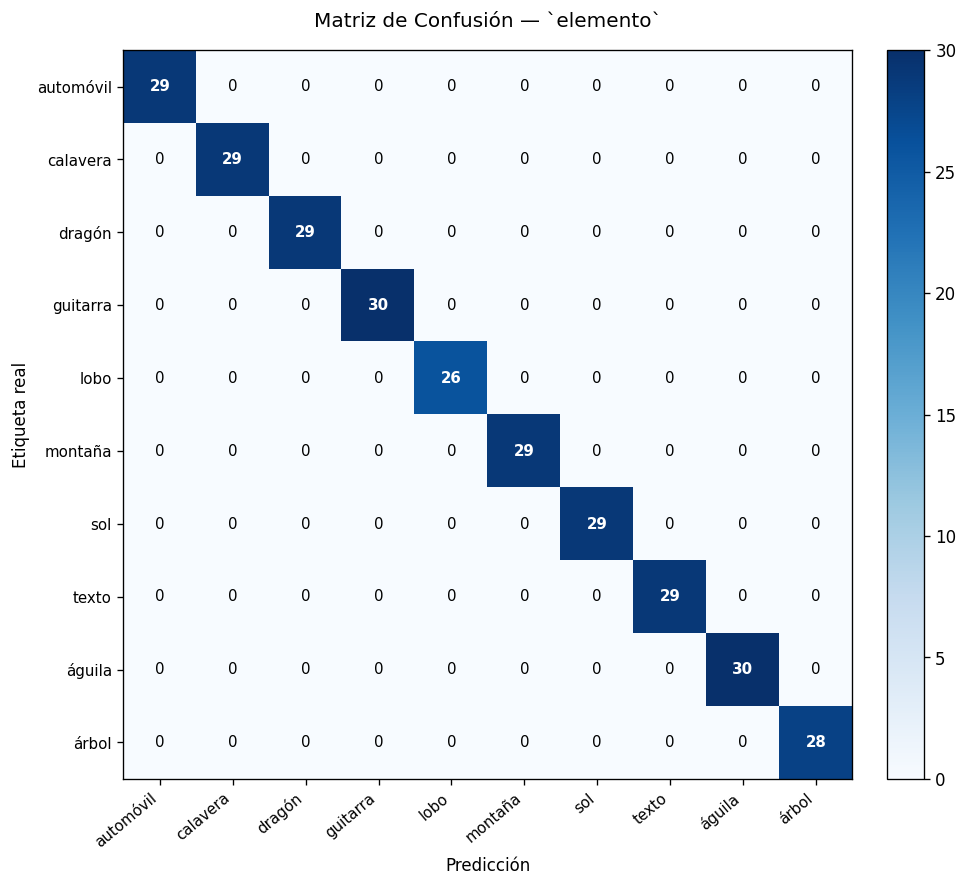
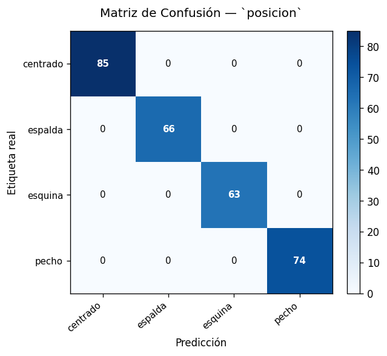

# Reporte de Evaluación Final — Fase E

> **Proyecto:** Tesis de Maestría — Interpretación de Prompts NLP para generación SVG  
> **Generado:** 2026-07-08 22:47:38  
> **Fase:** E — Evaluación final del modelo  

---

## 1. Configuración de la Evaluación

| Parámetro | Valor |
|---|---|
| Dispositivo | `cuda` |
| Checkpoint evaluado | `best_model.pt` |
| Época del checkpoint | 5 |
| Val loss (entrenamiento) | 0.2844 |
| Dataset de prueba | `dataset_test.csv` |
| Muestras test | 288 |

---

## 2. Métricas Globales

| Métrica | Valor |
|---|---|
| **Mean Accuracy** | **100.00%** |
| **Mean F1 Macro** | **100.00%** |

---

## 3. Métricas por Tarea

### 3.1 `color` (6 clases)

| Métrica | Valor |
|---|---|
| Accuracy | 100.00% |
| Precision Macro | 100.00% |
| Recall Macro | 100.00% |
| F1 Macro | 100.00% |

**Clases:** `azul`, `blanco`, `gris`, `negro`, `rojo`, `verde`

### 3.2 `estilo` (5 clases)

| Métrica | Valor |
|---|---|
| Accuracy | 100.00% |
| Precision Macro | 100.00% |
| Recall Macro | 100.00% |
| F1 Macro | 100.00% |

**Clases:** `deportivo`, `minimalista`, `retro`, `urbano`, `vintage`

### 3.3 `elemento` (10 clases)

| Métrica | Valor |
|---|---|
| Accuracy | 100.00% |
| Precision Macro | 100.00% |
| Recall Macro | 100.00% |
| F1 Macro | 100.00% |

**Clases:** `automóvil`, `calavera`, `dragón`, `guitarra`, `lobo`, `montaña`, `sol`, `texto`, `águila`, `árbol`

### 3.4 `posicion` (4 clases)

| Métrica | Valor |
|---|---|
| Accuracy | 100.00% |
| Precision Macro | 100.00% |
| Recall Macro | 100.00% |
| F1 Macro | 100.00% |

**Clases:** `centrado`, `espalda`, `esquina`, `pecho`

---

## 4. Interpretación de Resultados

El modelo MultiTaskDistilBERT alcanzó un desempeño **excelente** sobre el conjunto de prueba, con una accuracy media de **100.0%** y un F1 macro medio de **100.0%** considerando las cuatro tareas de clasificación simultáneas.

La tarea con **mejor desempeño** fue `color` (accuracy = 100.0%), lo que indica que el modelo captura adecuadamente los patrones lingüísticos asociados a este atributo de diseño SVG. La tarea con **menor desempeño** fue `color` (accuracy = 100.0%), lo que puede atribuirse a una mayor ambigüedad léxica en los prompts o a la mayor cardinalidad de clases en esta dimensión.

Las matrices de confusión por tarea permiten identificar las clases con mayor tasa de error e informar decisiones de mejora en fases futuras del proyecto.

---

## 5. Artefactos Generados

| Artefacto | Descripción |
|---|---|
| `evaluation_metrics.json` | Métricas completas en formato JSON |
| `evaluation_report.md` | Este reporte |
| `classification_report_color.md` | Reporte detallado por clase — `color` |
| `confusion_matrix_color.png` | Matriz de confusión — `color` |
| `classification_report_estilo.md` | Reporte detallado por clase — `estilo` |
| `confusion_matrix_estilo.png` | Matriz de confusión — `estilo` |
| `classification_report_elemento.md` | Reporte detallado por clase — `elemento` |
| `confusion_matrix_elemento.png` | Matriz de confusión — `elemento` |
| `classification_report_posicion.md` | Reporte detallado por clase — `posicion` |
| `confusion_matrix_posicion.png` | Matriz de confusión — `posicion` |

---

> *Generado automáticamente por `evaluate.py` — Fase E del proyecto de tesis.*