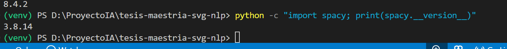

# Bitácora de desarrollo del MVP

## Sesión 01: Configuración inicial del entorno

**Fecha:** 07/07/2026  
**Responsable:** Eliasith Sandi  
**Proyecto:** Sistema basado en NLP y aprendizaje automático para generar diseños SVG de camisetas desde prompts

### Objetivo de la sesión

Configurar el entorno inicial de desarrollo para comenzar la implementación del Producto Mínimo Viable (MVP), correspondiente a la Entrega 3 del proyecto.

### Actividades realizadas

- Activación del entorno virtual `venv`.
- Verificación de la versión de Python instalada.
- Actualización de `pip`, `setuptools` y `wheel`.
- Instalación de dependencias base:
  - NumPy
  - Pandas
  - Scikit-learn
  - Matplotlib
  - Streamlit
- Verificación de instalación mediante una prueba de importación en Python.

### Comandos utilizados

```powershell
.\venv\Scripts\Activate.ps1
python --version
python -m pip install --upgrade pip setuptools wheel
pip install numpy pandas scikit-learn matplotlib streamlit
python -c "import numpy, pandas, sklearn, streamlit; print('Dependencias base instaladas correctamente')"
```


## Evidencia


---

# Sesión 02: Configuración del entorno NLP

**Fecha:** 07/07/2026  
**Responsable:** Eliasith Sandi  
**Proyecto:** Sistema basado en NLP y aprendizaje automático para generar diseños SVG de camisetas desde prompts

## Objetivo de la sesión

Preparar el entorno para el desarrollo del módulo de Procesamiento de Lenguaje Natural (NLP), asegurando la compatibilidad entre Python, spaCy y sus dependencias.

## Actividades realizadas

- Se detectó un problema al importar spaCy debido a incompatibilidades del entorno inicial.
- Se migró el proyecto a una ruta más corta para evitar conflictos con Windows.
- Se recreó el entorno virtual utilizando Python 3.10.11.
- Se actualizaron las herramientas base (`pip`, `setuptools` y `wheel`).
- Se instaló la biblioteca spaCy.
- Se resolvió la dependencia faltante (`click`).
- Se verificó correctamente la instalación de spaCy.

## Comandos utilizados

```powershell
py -3.10 -m venv venv
.\venv\Scripts\Activate.ps1
python -m pip install --upgrade pip setuptools wheel
pip install spacy
pip install click
python -c "import spacy; print(spacy.__version__)"
```

## Resultado obtenido

El entorno de desarrollo quedó correctamente configurado para trabajar con spaCy 3.8.14 utilizando Python 3.10.11. La instalación fue validada mediante una prueba de importación exitosa.

## Evidencia



## Observaciones

La migración del proyecto a una ruta más corta permitió eliminar los problemas encontrados durante la carga inicial de spaCy, garantizando un entorno estable para el desarrollo del módulo NLP.


# Sesión 03 – Inicio del desarrollo del módulo NLP

**Fecha:** _(coloca la fecha correspondiente)_  
**Estado:** ✅ Completada

## Objetivo

Iniciar el desarrollo del módulo de Procesamiento del Lenguaje Natural (NLP) del MVP mediante la implementación de una primera versión funcional basada en spaCy, capaz de procesar prompts en español y extraer información lingüística relevante para el proyecto.

---

## Actividades realizadas

### 1. Verificación del entorno de desarrollo

Se verificó el correcto funcionamiento del entorno configurado en las sesiones anteriores.

- Python 3.10.11
- Entorno virtual (venv) activo
- spaCy 3.8.14 instalado y operativo

**Resultado:** Entorno listo para iniciar el desarrollo del módulo NLP.

---

### 2. Instalación del modelo de español de spaCy

Se descargó e instaló el modelo lingüístico:

- `es_core_news_sm`

Posteriormente se verificó su correcta carga mediante una prueba de importación y ejecución.

**Resultado:** Modelo instalado y disponible para el procesamiento de texto en español.

---

### 3. Creación de la estructura inicial del módulo NLP

Se creó la estructura base del proyecto para el desarrollo del módulo de procesamiento de lenguaje natural.

```text
src/
│
├── main.py
│
└── nlp/
    ├── __init__.py
    ├── processor.py
    └── test_prompt.py
```

Se implementó la clase `NLPProcessor`, responsable de cargar el modelo de spaCy y realizar el análisis inicial de los prompts.

---

### 4. Primera prueba funcional

Se procesó el siguiente prompt de prueba:

> "Quiero una camiseta negra con un dragón rojo en estilo minimalista"

El sistema obtuvo correctamente:

- Tokens
- Lemas
- Sustantivos
- Adjetivos
- Entidades nombradas

Esta prueba confirma el correcto funcionamiento de la primera versión del módulo NLP.

---

## Resultados obtenidos

Al finalizar esta sesión el proyecto dispone de un módulo NLP funcional (Versión 0.1) capaz de:

- Procesar prompts escritos en español.
- Tokenizar el texto.
- Obtener lemas.
- Identificar sustantivos y adjetivos.
- Detectar entidades nombradas.
- Devolver la información estructurada mediante la clase `NLPProcessor`.

Este constituye el primer componente funcional del MVP.

---

## Decisiones técnicas

Durante la sesión se revisó el código generado inicialmente con GitHub Copilot.

Después de la revisión técnica se decidió:

- Mantener la arquitectura propuesta.
- Conservar la clase `NLPProcessor` como base del módulo NLP.
- Posponer mejoras avanzadas (logging, manejo de excepciones y tipado más específico) para etapas posteriores del proyecto.
- Considerar esta implementación como la **Versión 0.1 del módulo NLP**.

Asimismo, se revisó nuevamente la planificación general del proyecto y se confirmó que el desarrollo continuará siguiendo el ciclo completo de un proyecto de Inteligencia Artificial. Antes de integrar el motor SVG será necesario completar el diseño del dataset sintético, el entrenamiento supervisado del modelo DistilBERT y su evaluación mediante métricas de clasificación.

---

## Evidencias

**EV-003** – Primer procesamiento de un prompt utilizando el modelo `es_core_news_sm` de spaCy.

**Archivo:**

```
docs/capturas/EV-003_nlp_primer_prompt.png
```

La evidencia muestra la ejecución exitosa del módulo NLP y la extracción de información lingüística a partir de un prompt de prueba.

---

## Estado del proyecto

| Componente | Estado |
|------------|--------|
| Entorno de desarrollo | ✅ |
| spaCy | ✅ |
| Modelo español | ✅ |
| Módulo NLP | ✅ Versión 0.1 |
| Primera prueba funcional | ✅ |
| Evidencia EV-003 | ✅ |

---

## Próxima sesión

**Sesión 04**

Diseño e implementación del dataset sintético de 2,000 prompts para el entrenamiento supervisado del modelo DistilBERT, incluyendo la definición de atributos, estructura del conjunto de datos y estrategia de preparación para el entrenamiento.
