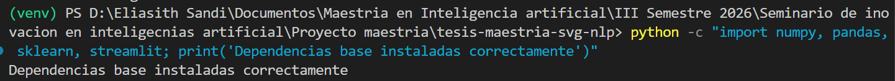

# Bitácora de desarrollo del MVP

## Sesión 01: Configuración inicial del entorno

**Fecha:** 07/07/2026  
**Responsable:** Eliasith Sandi  
**Proyecto:** Sistema basado en NLP y aprendizaje automático para generar diseños SVG de camisetas desde prompts

### Objetivo de la sesión

Configurar el entorno inicial de desarrollo para comenzar la implementación del Producto Mínimo Viable (MVP), correspondiente a la Entrega 3 del proyecto.

### Actividades realizadas

- Activación del entorno virtual `venv`.
- Verificación de la versión de Python instalada.
- Actualización de `pip`, `setuptools` y `wheel`.
- Instalación de dependencias base:
  - NumPy
  - Pandas
  - Scikit-learn
  - Matplotlib
  - Streamlit
- Verificación de instalación mediante una prueba de importación en Python.

### Comandos utilizados

```powershell
.\venv\Scripts\Activate.ps1
python --version
python -m pip install --upgrade pip setuptools wheel
pip install numpy pandas scikit-learn matplotlib streamlit
python -c "import numpy, pandas, sklearn, streamlit; print('Dependencias base instaladas correctamente')"
```


## Evidencia


